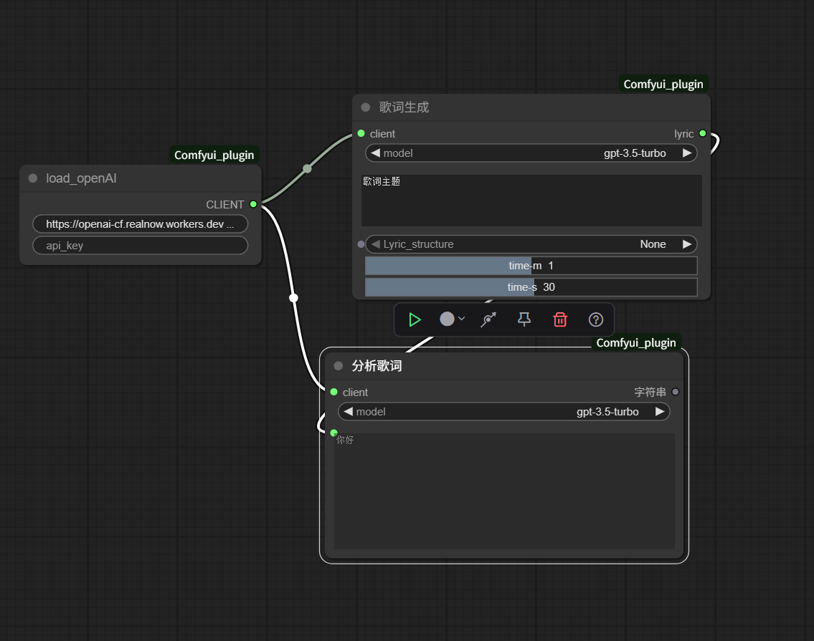
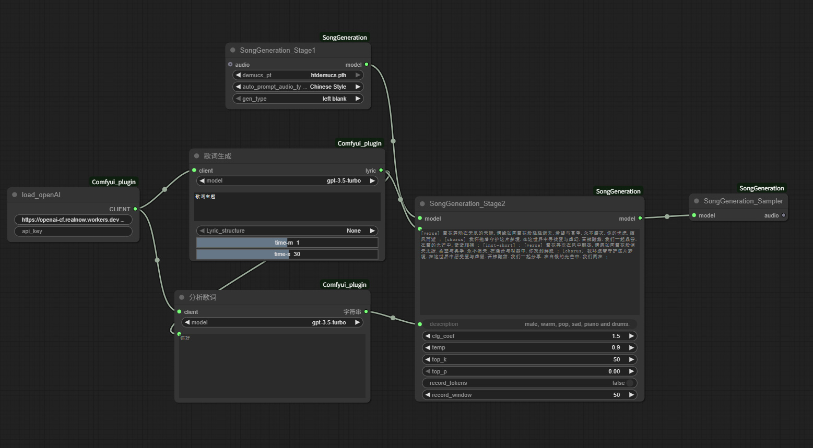

# 自制的Comfyui插件
## 腾讯的songgeneration模型的ai音乐歌词生成插件
## wan2.2 all in one的节点 WanVideoVACEStartToEndFrame
**参考了以下的仓库代码**

[omar92](https://github.com/omar92/ComfyUI-QualityOfLifeSuit_Omar92.git)

[willzhou](https://github.com/willzhou/MusicFayIn.git)

